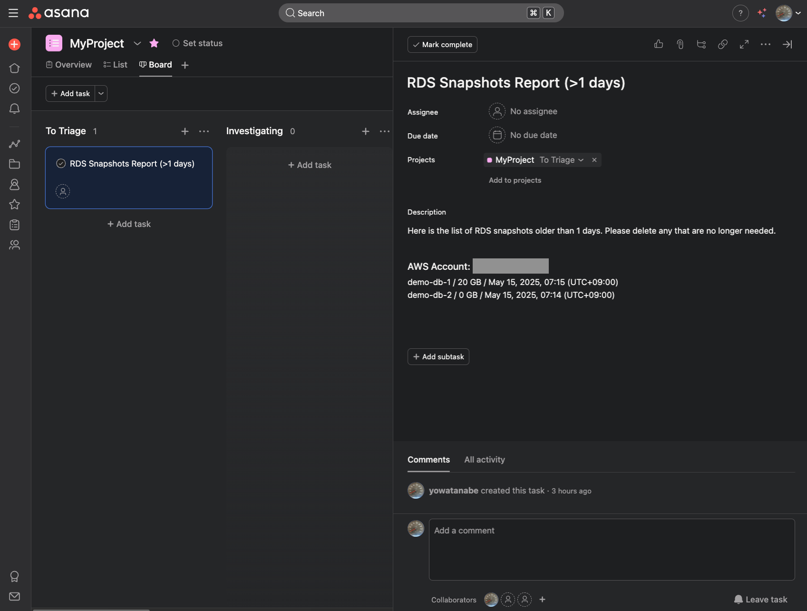

# 📘 RDS Snapshot Checker

A lightweight AWS Lambda solution to periodically check outdated RDS and Aurora snapshots and report them to Asana.

## 🧭 Features

* Supports both RDS and Aurora snapshots.
* Detects snapshots older than a configurable threshold.
* Posts a summary to Asana as a task, including snapshot name, size, and creation time.
* Scheduled via EventBridge with customizable frequency.
* Secrets (e.g., Asana PAT) are managed securely via AWS Secrets Manager.

## 📂 Project Structure

```
.
├── .terraform/                     # Cache directory for Terraform plugins, etc. (excluded from Git)
├── lambda/
│   ├── pytz/                       # Python timezone library (excluded from Git)
│   ├── pytz-*.dist-info/           # Metadata for pytz (excluded from Git)
│   ├── app.py                      # Lambda function source code
│   └── app.zip                     # Deployment package (excluded from Git)
├── .gitignore                      # Git ignore rules
├── .terraform.lock.hcl             # Terraform provider lock file
├── eventbridge.tf                  # EventBridge rule definition
├── iam.tf                          # IAM policies and roles
├── lambda.tf                       # Lambda function definition
└── README.md                       # Project documentation
├── secretsmanager.tf               # Secrets Manager resource definitions
├── terraform.auto.tfvars           # Variables (excluded from Git)
├── terraform.auto.tfvars.template  # Template for variables
├── terraform.tfstate               # Terraform state file (excluded from Git)
├── terraform.tfstate.backup        # Terraform state backup (excluded from Git)
├── variables.tf                    # Variable definitions
├── versions.tf                     # Provider versions
├── zip.sh                          # Script to create deployment package
```

## 🚀 Getting Started

### Prerequisites

* Terraform (Tested with version `1.12.0`)
* Python (Tested with version `3.12`)
* AWS account (with permissions to create Lambda, IAM, EventBridge, Secrets Manager)
* Asana Personal Access Token

### Setup

1. Clone the repository.

   ```bash
   git clone https://github.com/yowatanabe/devops-tools.git
   cd terraform/rds-snapshot-checker
   ```

1. Create `terraform.auto.tfvars` from the provided template.

   ```bash
   cp terraform.auto.tfvars.template terraform.auto.tfvars
   ```

1. Edit `terraform.auto.tfvars` to include your Asana PAT and project ID.

1. Deploy with the following command

    ```bash
    chmod +x zip.sh
    ./zip.sh
    terraform init
    terraform apply
    ```

## 🛠️ Configuration

The following variables should be defined in a file named `terraform.auto.tfvars`, which Terraform will automatically load during execution:

* `asana_personal_token_value`: Your Asana Personal Access Token
* `asana_project_id`: ID of the Asana project to create tasks in
* `schedule_expression`: Cron or rate expression for EventBridge (e.g., `cron(0 0 1 * ? *)`)
* `snapshot_age_days`: Threshold in days to consider a snapshot as outdated

> 💡 Be sure to add `terraform.auto.tfvars` to `.gitignore` to avoid committing sensitive credentials to your repository.


## 📝 Asana Task Format

The Lambda function posts a task to Asana with the following content:



> 🖼️ *Example: The task shows RDS snapshots that are older than **1 day**. This is just for demonstration purposes and can be adjusted by setting `snapshot_age_days`.*

The task includes snapshot name, size, and creation time.
